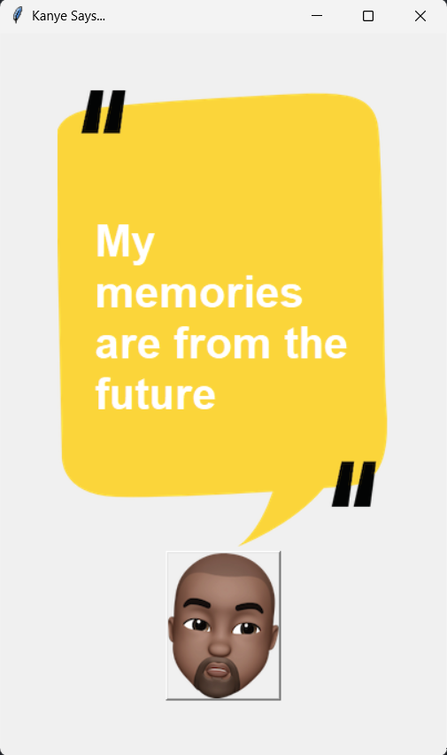

## README for **Kanye-Quote**

### Project Title
**Kanye-Quote**  
_Tkinter-based Kanye West quote generator_

---

### Description  
A lightweight desktop application written in Python using the `Tkinter` GUI library. When launched, it displays a random Kanye West quote (or lyric) along with a background image for visual appeal.

---

### Features
- **Random Kanye quotes**: Displays a new quote on demand.
- **Visual interface**: Integrated background imagery for an aesthetic experience.
- **Easy to run**: Requires only Python and Tkinter to get started.

---

### Prerequisites  
- Python 3.x (tested with 3.8+)  
- Tkinter (usually included with Python; if not, install via your system's package manager)

---

### Installation & Usage
1. **Clone the repository**:  
   ```bash
   git clone https://github.com/Thunderer9506/Kanye-Quote.git
   cd Kanye-Quote
   ```
2. **Run the application**:  
   ```bash
   python main.py
   ```
   A window should appear, showing a Kanye quote over a striking background.

---

### Screenshot  



---

### File Structure
```
Kanye-Quote/
├── main.py          # Core application logic
├── background.png   # Background image displayed in the GUI
├── kanye.png        # (Optional) icon or additional imagery
└── README.md        # Project overview and instructions
```

---

### How It Works  
- **`main.py`** initializes the Tkinter window, loads the background image (e.g., `background.png`), and selects a random quote—perhaps from an internal list or file.
- The GUI then displays the quote text (and possibly Kanye’s image or icon) on top of the background.

---

### Contributing  
Feel free to Improve it by:
- Adding more quotes or allowing quote sourcing from an external file or API.
- Customizing the UI appearance (fonts, layout, themes).
- Packaging the app into an executable for easier sharing.

Pull requests, issues, and suggestions are warmly welcomed!
